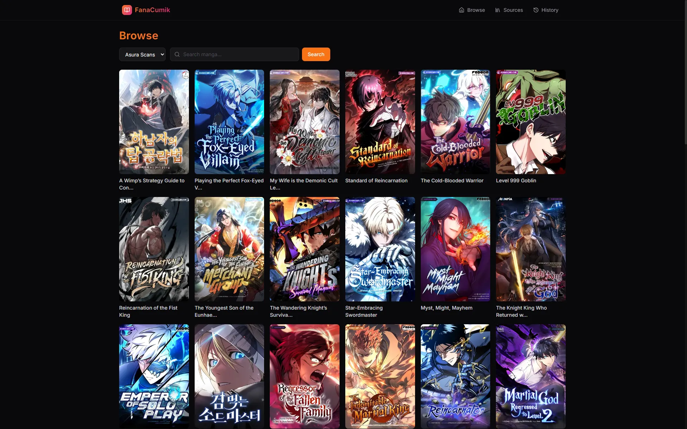
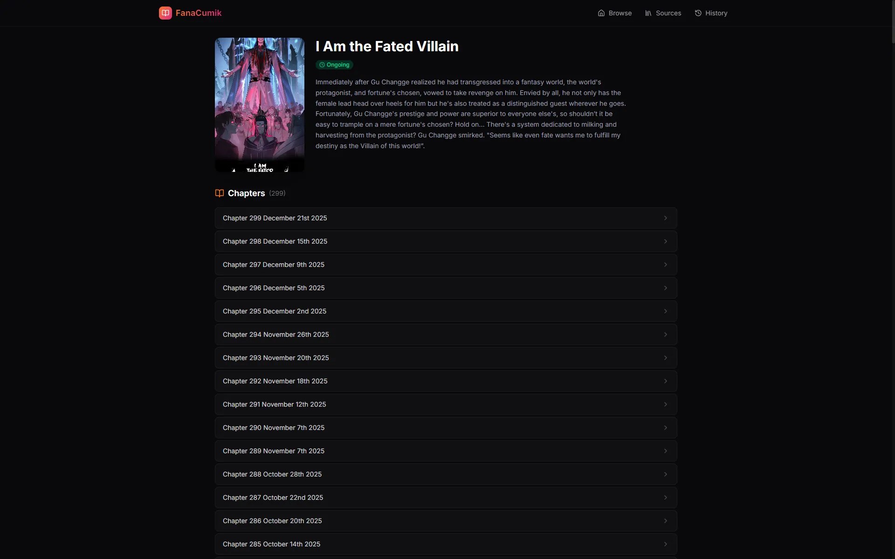
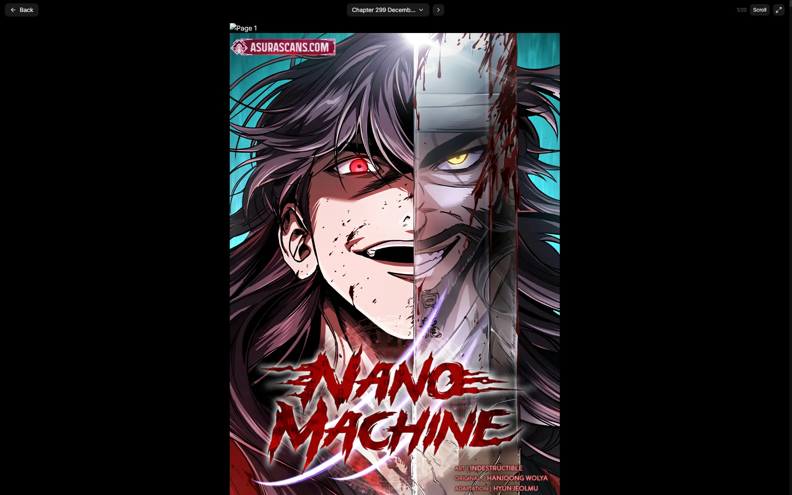
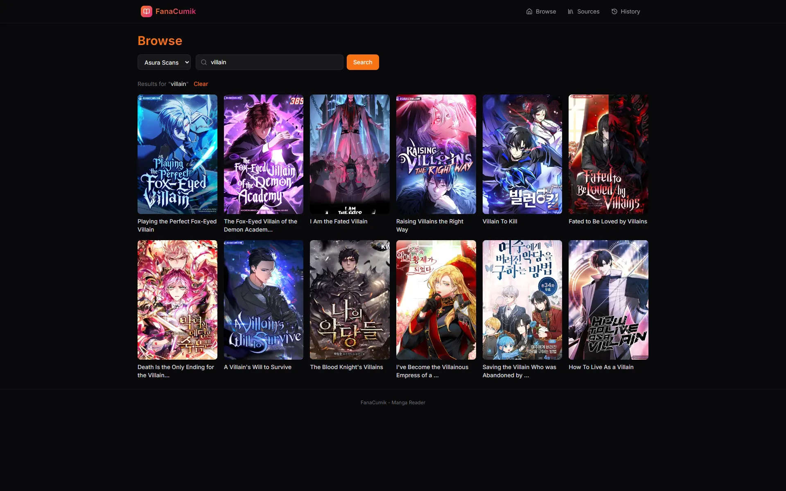
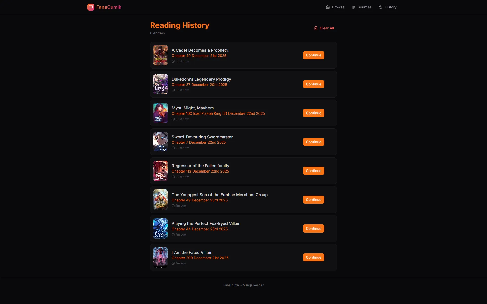

<p align="center">
  <h1 align="center">🦑 FanaCumik</h1>
</p>

<p align="center">
  
  
  
  
  
</p>

<p align="center">
  <strong>A lightning-fast, ad-free manga reader built for the Edge.</strong>
</p>

<p align="center">
  <a href="https://cumik.fana.my.id">
    
  </a>
</p>

---

## 📖 About

**FanaCumik** is a modern manga aggregator designed to provide a seamless reading experience. Built with **SvelteKit** and deployed on **Cloudflare Workers**, it scrapes content in real-time, strips away ads and trackers, and delivers chapters with zero bloat.

Whether you are a reader looking for a clean UI or a developer wanting to learn about scraping and edge rendering, this project is for you.

## ✨ Features

- **⚡ Edge-Powered Performance**: Server-Side Rendering (SSR) running on Cloudflare for global low latency.
- **🚫 Ad-Free Experience**: Content is proxied and cleaned; no popups or redirects.
- **📱 Mobile-First UI**: A responsive, app-like experience with smooth scrolling and intuitive navigation.
- **🧩 Multi-Source System**: Currently supports **Asura Scans** and **MangaLife**, with an extensible adapter pattern for adding more.
- **🕵️ Smart Proxying**: Built-in image proxy (`/api/proxy`) handles Referer spoofing to bypass hotlink protection.
- **💾 Local History**: Automatically tracks your reading progress and saves it to your browser's local storage.

---

## 📸 Sneak Peek

### Home / Browse

<p align="center">
  
</p>

|                         **Manga Details**                         |                         **Reading Mode**                         |
| :---------------------------------------------------------------: | :--------------------------------------------------------------: |
|  |  |

|                            **Search**                             |                             **History**                             |
| :---------------------------------------------------------------: | :-----------------------------------------------------------------: |
|  |  |

## 🛠️ Tech Stack

- **Framework:** [SvelteKit](https://kit.svelte.dev/) (SSR)
- **Styling:** [TailwindCSS](https://tailwindcss.com/)
- **Language:** TypeScript
- **Scraping:** [Cheerio](https://cheerio.js.org/)
- **Deployment:** Cloudflare Pages / Workers
- **Icons:** Lucide Svelte

---

## 🚀 Getting Started

Follow these steps to run the project locally.

### Prerequisites

- Node.js (v18+ recommended)
- pnpm (recommended) or npm

### Installation

1.  **Clone the repository**

    ```bash
    git clone https://github.com/MasFana/fana-cumik.git
    cd fana-cumik
    ```

2.  **Install dependencies**

    ```bash
    pnpm install
    ```

3.  **Start the development server**

    ```bash
    pnpm dev
    ```

4.  **Explore**
    Open `http://localhost:5173` in your browser.

---

## 🤝 Contributing

We love contributions! The project is designed to be easily extensible. The most common contribution is adding a new **Manga Source**.

### How to Add a New Source

FanaCumik uses an adapter pattern. All logic for a specific site lives in one file.

1.  Create a new file in `src/lib/server/sources/impl/` (e.g., `Mangabat.ts`).
2.  Extend the `BaseSource` class and implement the required methods:

```typescript
// src/lib/server/sources/impl/Mangabat.ts
import { BaseSource } from '../BaseSource';
import type { Manga, MangaDetails, IMangaSource } from '../types';
import * as cheerio from 'cheerio';

export class MangabatSource extends BaseSource {
    id = 'mangabat';
    name = 'Mangabat';
    baseUrl = 'https://mangabat.com';

    async getLatestManga(page: number): Promise<Manga[]> {
        // 1. Fetch HTML using this.fetchHtml()
        // 2. Parse with cheerio
        // 3. Return array of Manga objects
    }

    async searchManga(query: string): Promise<Manga[]> { ... }
    async getMangaDetails(mangaId: string): Promise<MangaDetails> { ... }
    async getChapterPages(chapterId: string): Promise<string[]> { ... }
}
```

3.  Register your new source in `src/lib/server/sources/index.ts`:

```typescript
import { MangabatSource } from './impl/Mangabat';

const sources: Record<string, IMangaSource> = {
    asura: new AsuraSource(),
    mangabat: new MangabatSource(), // <-- Add this
};
```

---

## ⚠️ Disclaimer

This project is for **educational and research purposes only**. It demonstrates how to build modern web applications using SvelteKit and Edge computing.

The developer of this application does not host any content. All data is scraped from third-party websites. Please support the original creators and official releases where available.

## 📄 License

Distributed under the MIT License. See `LICENSE` for more information.
